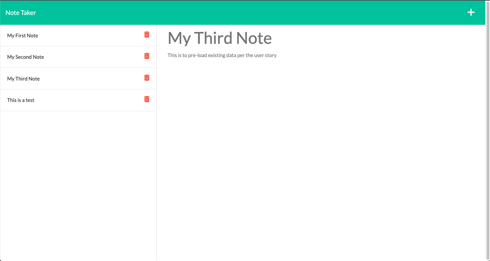

# challenge-11-note-taker

## This challenge, we are using express to create a note taker application.

## This application allows,the user to create and save new notes for their records.

## Using express.js we are able to parse data into a JSON file and retrieve datasing POST/GET methods.

## Additionally, to house the server we are using Heroku, we are deploying the application on both heroku and github.

## Image of application and links can be found below:

Repo: https://github.com/fayazl/challenge-11-note-taker 

Heroku Link: https://fl-note-taker.herokuapp.com/

